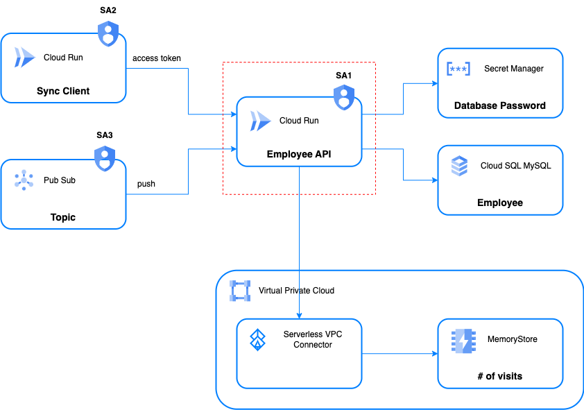
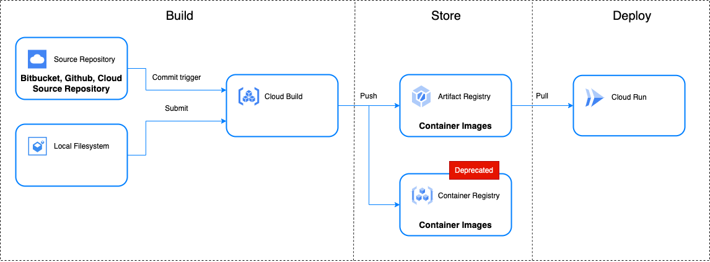
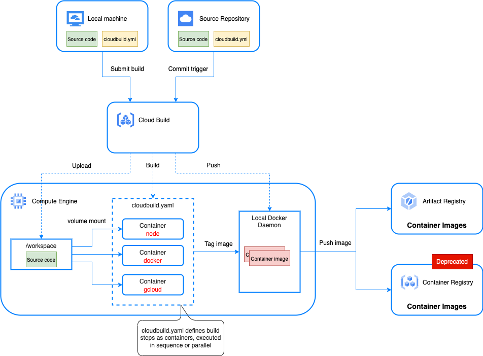
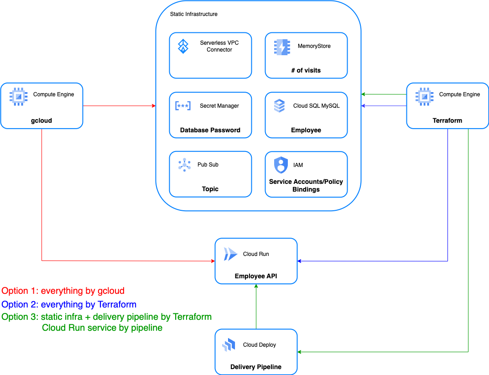

# Building a Restful API using Cloud SQL, Memorystore, Secret Manager, VPC Connector, Cloud Build, Cloud Deploy and Terraform

## Overview

This POC is to explore how Google Cloud Run can be used to implement cloud native Microservices.

I will build a Restful API to support the CRUD operations on the "Employee" resource.

The application is coded in Go, built using Cloud Build and deployed as a Cloud Run service.

As far as the deployment is concerned, I tried three options:

1. Google Cloud SDK - gcloud  CLI
2. Terraform for everything
3. Terraform + Google Cloud Deploy
	- Deploy everything except the Cloud Run service using Terraform
	- Build a Google Cloud Deploy delivery pipeline using Terraform
	- Deploy the Cloud Run using the delivery pipline  

## Architecture



- The main application is a Restful API that provides CRUD operations on the Employee resource.

- CloudSQL MySQL is used as the data store. The database has a public IP.

- A state - the number of calls/visits - is stored in a Redis MemoryStore that is located on a VPC. 

- The database password is stored in Secret Manager.

- The application connects to MySQL through Cloud SQL Auth Proxy (for data encryption). This is done using the Cloud SQL connectors library (other options: Unix Socket, TCP Socket).

- The application is deployed as a Cloud Run service using a service account which has two roles:

	- roles/cloudsql.client

	- roles/secretmanager.secretAccessor

- The application can be called synchronously by another Cloud Run service. The service-to-service authentication is done through access token.

- The CREATE operation is made available asynchronously as well. The client can publish a message onto a Pub/Sub topic. The API will be called to process the new employee information.

## Local Test


Only Docker engine is required. Just run the following command:

```bash
docker-compose build
docker-compose up
```

## Build

I will use Cloud Build to build application's Docker image using Google Cloud Build.

### Continuous Integration Flow



### Cloud Build Internals



### Build script

```bash
# Setup steps: e.g. enabling GCP APIs, creating Artifact Registry Repos
# ...

gcloud builds submit --tag $REPOSITORY/$SERVICE_NAME --region $REGION

```

## Deployment

### Options


### Using Google Cloud SDK - `gcloud`

```bash

#!/usr/bin/bash

## GCP project
EDITOR_NAME=philip.yang@scotiabank.com
PROJECT_ID=ibcwe-event-layer-f3ccf6d9
REGION=us-central1

## Artifact Registry
REPOSITORY=us-central1-docker.pkg.dev/$PROJECT_ID/cloud-run-try

## Database
INSTANCE_NAME=sql-db
DB_VERSION=MYSQL_8_0
DB_NAME=hr
DB_USER=user
PASSWORD=changeit

## Redis memorystore
REDIS_INSTANCE=employee
REDIS_TIER=basic
REDIS_SIZE=1

## VPC connector
VPC_CONNECTOR=employee
VPC_IP_RANGE="10.0.0.0/28"

## Secret manager secret
SECRET_NAME=DB_PASS

## Pubsub 
TOPIC_NAME=employee_creation
SUBSCRIPTION_NAME=employee-creation-sub


## Cloud run
SERVICE_NAME=employee-service
CLOUD_RUN_SA="gyre-dataflow@${PROJECT_ID}.iam.gserviceaccount.com"
INVOKER_SA=employee-api-invoker

gcloud config set project $PROJECT_ID
gcloud config set account $EDITOR_NAME
gcloud config set compute/region $REGION
gcloud config set compute/zone $REGION-a
gcloud config set run/region $REGION

# Enable APIs & Services
gcloud services enable run.googleapis.com
gcloud services enable secretmanager.googleapis.com
gcloud services enable artifactregistry.googleapis.com
gcloud services enable sqladmin.googleapis.com
gcloud services enable sql-component.googleapis.com
gcloud services enable pubsub.googleapis.com
gcloud services enable redis.googleapis.com
gcloud services enable vpcaccess.googleapis.com

# Create a Cloud SQL instance named sql-db
gcloud sql instances create $INSTANCE_NAME \
--tier db-f1-micro \
--database-version $DB_VERSION \
--region $REGION \
--root-password $PASSWORD
 
# Create the hr database
gcloud sql databases create $DB_NAME --instance $INSTANCE_NAME
 
# Create a db user
gcloud sql users create $DB_USER --instance $INSTANCE_NAME --password $PASSWORD
 
# Create a redis instance named employee
gcloud redis instances create $REDIS_INSTANCE --tier $REDIS_TIER --size $REDIS_SIZE --region $REGION
 
# Obtain and copy the redis IP and port that are required later
REDIS_PORT=$(gcloud redis instances list --region $REGION --format="value(port)")
REDIS_IP=$(gcloud redis instances list --region $REGION --format="value(RESERVED_IP)")
 
# Create a VPC access connector named employee
gcloud compute networks vpc-access connectors create $VPC_CONNECTOR \
--region $REGION \
--range $VPC_IP_RANGE

# Create a secret in Secret Manager to hold the database user password
echo -n "$PASSWORD" | gcloud secrets create $SECRET_NAME --replication-policy automatic --data-file=-

# get the latest enabled version of secret
SECRET_VERSION=$(gcloud secrets versions list $SECRET_NAME --filter="STATE=enabled" --format="value(NAME)" --sort-by ~CREATED --limit 1)


# Create a Pubsub topic named employee_creation
gcloud pubsub topics create $TOPIC_NAME

# Create a service account to be used provide the OIDC token when push pubsub message to cloud run
gcloud iam service-accounts create $INVOKER_SA --display-name "SA calling employee api"

# Obtain the service account's email address that is required later
INVOKER_EMAIL=$(gcloud iam service-accounts list --format='value(email)' --filter="name~$INVOKER_SA")

# Enable project's Pub/Sub service agent to create access tokens
PROJECT_NUMBER=$(gcloud projects list \
--filter="ibcwe-event-layer" \
--format='value(PROJECT_NUMBER)')

gcloud projects add-iam-policy-binding $PROJECT_ID \
--member=serviceAccount:service-$PROJECT_NUMBER@gcp-sa-pubsub.iam.gserviceaccount.com \
--role=roles/iam.serviceAccountTokenCreator

# Create the cloud Run service
gcloud run deploy $SERVICE_NAME --image $REPOSITORY/$SERVICE_NAME \
--service-account=$CLOUD_RUN_SA \
--add-cloudsql-instances "${PROJECT_ID}:${REGION}:${INSTANCE_NAME}" \
--vpc-connector $VPC_CONNECTOR \
--no-allow-unauthenticated \
--set-env-vars DB_USER=$DB_USER \
--set-secrets DB_PASS="${SECRET_NAME}:${SECRET_VERSION}" \
--set-env-vars DB_NAME=$DB_NAME \
--set-env-vars DB_PRIVATE_IP= \
--set-env-vars INSTANCE_CONNECTION_NAME="${PROJECT_ID}:${REGION}:${INSTANCE_NAME}" \
--set-env-vars REDIS_HOST=${REDIS_IP%/*} \
--set-env-vars REDIS_PORT=$REDIS_PORT

# Obtain the URI of the Employee API service and set it as an environment var
EMPLOYEE_API=$(gcloud run services describe $SERVICE_NAME --format='value(status.address.url)')

# IAM policy binding: grant the service account the "role/run.invoker" role
# to the Employee API Cloud Run service.

gcloud run services add-iam-policy-binding $SERVICE_NAME \
--member=serviceAccount:"${INVOKER_EMAIL}" \
--role=roles/run.invoker

# Create a Pubsub subscription to push message to the Cloud Run service
gcloud pubsub subscriptions create $SUBSCRIPTION_NAME \
--topic $TOPIC_NAME \
--push-endpoint=$EMPLOYEE_API \
--push-auth-service-account="${INVOKER_EMAIL}"

# Get dbpassword from secret manager
MYSQL_PASS=$(gcloud secrets versions access $SECRET_VERSION --secret=$SECRET_NAME)

# Create and poplate tables
cloud-sql-proxy --port 3306 ${PROJECT_ID}:${REGION}:${INSTANCE_NAME} &
sleep 15
mysql -u root -p$MYSQL_PASS --host 127.0.0.1 < ../../schema.sql

# stop sqlproxy
pgrep -f cloud-sql-proxy|xargs kill
```

### Using Terraform Open Source

Separating Cloud Run service from the rest resource as the deploying the service is more frequent than the rest infrastructure (Cloud SQL, Memorystore, Pubsub, etc.). And I will deploy the Cloud Run service using Google Cloud Deploy that is more suitable for code release management.

The terraform configuration is as follows:

```text
$ tree
.
├── cloudrun
│   ├── backend.tf
│   ├── data.tf
│   ├── main.tf
│   ├── outputs.tf
│   ├── providers.tf
│   ├── subscription.tf
│   ├── terraform.tfvars
│   └── variables.tf
└── infra
    ├── backend.conf
    ├── backend.tf
    ├── cloudsql.tf
    ├── outputs.tf
    ├── project-services.tf
    ├── providers.tf
    ├── redis.tf
    ├── secrets.tf
    ├── service-account.tf
    ├── terraform.tfvars
    ├── topic.tf
    ├── variables.tf
    └── vpc-connector.tf
```

Here is how to apply the Terraform configurations.
```bash
# Create the infrastructure first
cd infra
terraform init
terraform plan
terraform apply --auto-approve
 
# Creating the Cloud Run service and pubsub subscription
cd ../cloudrun
terraform init
terraform plan
terraform apply --auto-approve

# Configuring the db
populate.sh
```

### Using Google Cloud Deploy - Separating Infrastructure, Delivery Pipeline from Application

I will create a delivery pipeline using Google Cloud Deploy. This pipeline is a sequential pipeline that supports three targets - IST, UAT and PRD. A review and approval are required to promote to PRD.

I will use Terraform to provision the pipelines. As the delivery pipeline is a regional resource, Terraform workspace is used to provision pipelines on the primary and secondary regions.

```text
pipeline/
├── backend.tf
├── create-release.sh
├── employee-ist.yaml
├── employee-prd.yaml
├── employee-uat.yaml
├── main.tf
├── providers.tf
├── skaffold.yaml
├── uc1.tfvars
├── ue4.tfvars
└── variables.tf
```

To create two workspaces - uc1  and ue4

```bash
terraform workspace new uc1
terraform workspace new ue4
```

To create the pipeline on us-central1 

```bash
terraform workspace select uc1
terraform apply --auto-approve --var-file uc1.tfvars
```

To create the pipeline on us-east4 

```bash
terraform workspace select ue4
terraform apply --auto-approve --var-file ue4.tfvars
```

After the delivery pipeline is created successfully, we can create a release and use the pipeline to rollout the Employee API Cloud Run service to IST, then UAT, and finally to PRD once the reviewer approves.


## Testing

### Table Preparation

```bash
cd dba
./populate.sh
```

### Obtaining Cloud Run service endpoint

Get the URL and set it as an environment variable
```bash
EMPLOYEE_API=$(gcloud run services describe employee-service --format='value(status.address.url)')  
```

### API version which contains session information

HTTP GET call that returns data stored in MemoryStore

```bash
$ curl -H "Authorization: Bearer $(gcloud auth print-identity-token)" $EMPLOYEE_API/api/help

Employee API v1. You are visitor number 9
```

Notice the phrase "You are visitor number 9" in the printout. This number increments every time when `/api/help` is called. That demos the Cloud Run service can successfully access to the Redis MemoryStore located on the VPC. 

### List all employees

HTTP GET call that returns all the record in the database table

```bash
$ curl -H "Authorization: Bearer $(gcloud auth print-identity-token)" \
  $EMPLOYEE_API/api/employee | jq
 
[
    {
        "id": "1",
        "first_name": "John",
        "last_name": "Doe",
        "department": "Products",
        "salary": 200000,
        "age": 25
    },
    {
        "id": "2",
        "first_name": "Jane",
        "last_name": "Doe",
        "department": "Sales",
        "salary": 100000,
        "age": 22
    }
]
```

### Create a new employee - synchronous call

HTTP POST - sync

```bash
$ curl -H "Authorization: Bearer $(gcloud auth print-identity-token)" \
  -d '{"first_name":"Shrek","last_name":"Unknown","department":"Royal","salary":200000,"age":25}' \
  -X POST $EMPLOYEE_API/api/employee | jq
 
{
    "id": "3",
    "first_name": "Shrek",
    "last_name": "Unknown",
    "department": "Royal",
    "salary": 200000,
    "age": 25
}
```

### Create a new employee - async call

Use the Cloud web console to publish a message to the pubsub topic (employee_creation) as follows:


```yaml
{"first_name":"Fiona","last_name":"Unknown","department":"Royal","salary":10000,"age":22}
```

To verify the Cloud Run service is indeed called. Run the following command again and confirm Fiona's record is returned.

```bash
curl -H "Authorization: Bearer $(gcloud auth print-identity-token)" $EMPLOYEE_API/api/employee | jq
```


## Cleanup

### Using gcloud

```bash

#!/usr/bin/bash

## GCP project
EDITOR_NAME=philip.yang@scotiabank.com
PROJECT_ID=ibcwe-event-layer-f3ccf6d9
REGION=us-central1

## Artifact Registry
REPOSITORY=cloud-run-try

## Database
INSTANCE_NAME=sql-db

## Redis memorystore
REDIS_INSTANCE=employee

## VPC connector
VPC_CONNECTOR=employee

## Secret manager secret
SECRET_NAME=DB_PASS

## Pubsub 
TOPIC_NAME=employee_creation
SUBSCRIPTION_NAME=employee-creation-sub


## Cloud run
SERVICE_NAME=employee-service
INVOKER_SA=employee-api-invoker

gcloud config set project $PROJECT_ID
gcloud config set account $EDITOR_NAME
gcloud config set compute/region $REGION
gcloud config set compute/zone $REGION-a
gcloud config set run/region $REGION

# Enable APIs & Services
gcloud services enable run.googleapis.com
gcloud services enable secretmanager.googleapis.com
gcloud services enable artifactregistry.googleapis.com
gcloud services enable sqladmin.googleapis.com
gcloud services enable sql-component.googleapis.com
gcloud services enable pubsub.googleapis.com
gcloud services enable redis.googleapis.com
gcloud services enable vpcaccess.googleapis.com


gcloud run services delete $SERVICE_NAME
gcloud sql instances delete $INSTANCE_NAME
gcloud iam service-accounts delete "${INVOKER_SA}@${PROJECT_ID}.iam.gserviceaccount.com"
gcloud pubsub subscriptions delete $SUBSCRIPTION_NAME
gcloud pubsub topics delete $TOPIC_NAME
gcloud redis instances delete $REDIS_INSTANCE --region $REGION
gcloud compute networks vpc-access connectors delete $VPC_CONNECTOR --region $REGION
gcloud secrets delete $SECRET_NAME
gcloud artifacts packages delete $SERVICE_NAME --repository=$REPOSITORY --location=$REGION
```

### Using Terraform

```bash
cd cloudrun
terraform destroy --auto-approve
 
cd ../infra
terraform destroy --auto-approve
 
cd ../pipeline
terraform workspace select uc1
terraform destroy --auto-approve --var-file uc1.tfvars
terraform workspace select ue4
terraform destroy --auto-approve --var-file ue4.tfvars
```

